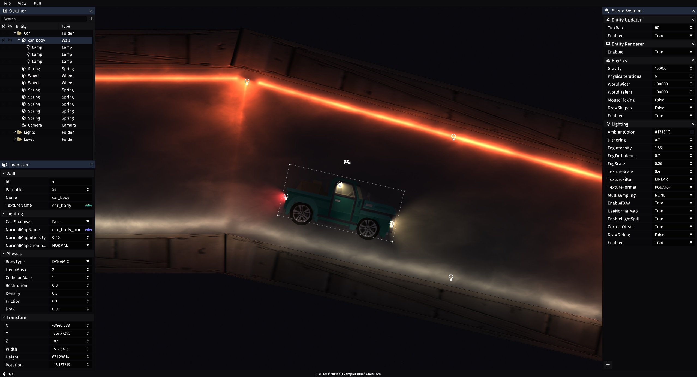

# Pulse Engine

[](https://repo.repsy.io/mvn/njoh/public/no/njoh/pulse-engine/0.12.0/)
[](http://kotlinlang.org)
[](https://github.com/NiklasJohansen/PulseEngine/actions)

Pulse Engine is a 2D game engine built with Kotlin and [LWJGL](https://www.lwjgl.org/).
The engine provides a basic toolkit for prototyping and developing smaller 2D games.



## 📋 Features
- Scene graph with entities and systems
- Scene editor with property inspector and live editing
- Saving and loading of scenes, entities and game state
- Fast 2D rendering of sprites, shapes and text
- Render targets (surfaces) with composable post-processing effects
- Support for custom renderers and shaders
- Global illumination (radiance cascades) with indirect/bounce lighting, normal mapping and SSAO
- Asset loading and hot reloading
- Basic audio playback
- Input handling for keyboard, mouse and gamepads
- Networking with UDP/TCP based client-server architecture
- Fast multithreaded game loop
- Collision detection and physics
- Responsive retained UI components
- Console commands and basic scripting
- Configuration loading and management
- Metrics and profiling/graphing

## 🕹️ Built with Pulse Engine

- [Botgang](https://github.com/NiklasJohansen/botgang) is a game where you program bots to compete in a top-down shooter
- [Shotgang](https://github.com/NiklasJohansen/shotgang) is a top-down competitive couch coop game
- [capra-ml-talk](https://github.com/NiklasJohansen/capra-ml-talk) is an interactive presentation of neural networks

## 🛠️ Usage
See the [Pulse Engine Game Template](https://github.com/NiklasJohansen/PulseEngineGameTemplate) repository for usage and examples.

The library is hosted on [repsy.io](https://repo.repsy.io/mvn/njoh/public) and can be 
included in your project by adding the following to your gradle build file:

```kotlin
repositories {
    maven {
        url 'https://repo.repsy.io/mvn/njoh/public'
    }
}

dependencies {
    implementation 'no.njoh:pulse-engine:0.12.0'
}
```

## ❗ Disclaimer
This library is a hobby project and only developed for fun and learning. It is not production ready and should not be used
for anything serious. Future changes and updates may, and probably will, break existing APIs.